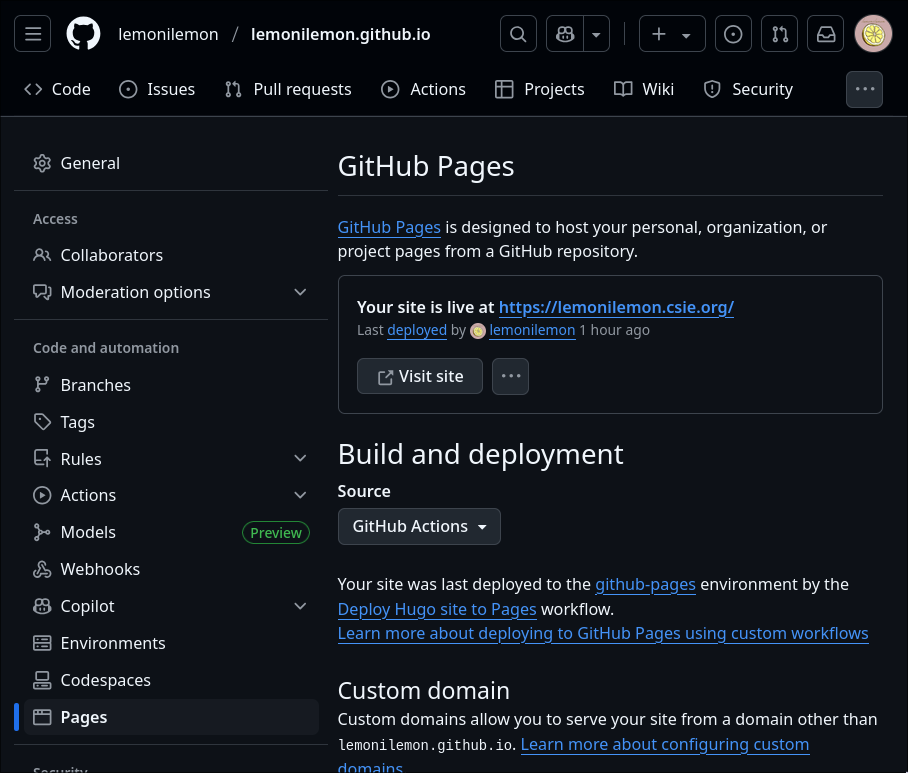

+++
draft = false
date = 2025-06-30T16:31:54+08:00
title = "用 Hugo + GitHub Pages 架設個人網站"
description = ""
slug = "hugo-site"
tags = ["Hugo","Site","Go"]
categories = ["Hugo"]
externalLink = ""
series = []
+++

# 前言
暑假找不到實習的我閒來無事，決定完成之前自己一直想要架設的個人網站。查了一下資料，我發現 Hugo 是一個不錯的選擇，這篇文章就是單純分享一下我架設個人網站的過程跟心得。為了紀念，我決定把這篇文章就直接放在我的網站上做個記錄。

Hugo 是一個用 Go 語言寫的 Static Site Generator (SSG), 得益於 Go 的效能，它可以用比傳統的 SSG 更少的時間來生成靜態網頁。Hugo 不僅簡單易用，而且功能十分強大，支援很多主題跟模板。像現在這個網站就是用 [Hugo-coder](https://github.com/luizdepra/hugo-coder) 的 Theme 來架設的。

# 安裝 Hugo
安裝 Hugo 並不是很困難的事情，[Hugo 的官方網站](https://gohugo.io/installation/)有提供不同 OS 的安裝方法。我用的是 NixOS，所以我是使用 `nix-shell` 來安裝 Hugo (我猜對別人沒那麼多參考價值，但我還是寫一下):

```bash
nix-shell -p hugo
```

接著檢查一下 Hugo 是否安裝成功:

```bash
hugo version
```

# 找個喜歡的主題
從 [Hugo Themes](https://themes.gohugo.io/) 上找一個喜歡的主題，這裡我選擇了 [Hugo-coder](https://themes.gohugo.io/themes/hugo-coder/)。就挑自己喜歡的即可，有很多主題也有 Demo 的網頁，可以點進去看實際的效果如何。基本上點開每個主題的 Download 按鈕就會跳到對應的 GitHub Repo, 裡面會有安裝說明，但基本上大同小異，就是將該 Repo 裡面的檔案作為 Submodule 引入到 themes 的資料夾，或者下載之後丟到該資料夾。以我的情況來說：

```bash
git submodule add https://github.com/luizdepra/hugo-coder.git themes/hugo-coder
```
這樣就可以把主題作為 Submodule 引入到 `themes/hugo-coder` 資料夾了。然後需要修改對應的 Hugo 設定檔 `hugo.toml`，改成對應的主題名稱，可以參考對應 theme 的 example 中的 `hugo.toml` 文件。像我的設定檔就長這樣：

```toml
baseurl = "https://lemonilemon.github.io/"
title = "lemonilemon's Blog"
theme = "hugo-coder"
languagecode = "zh-TW"
defaultcontentlanguage = "zh"

[pagination]
pagerSize = 20

[services]
[services.disqus]
shortname = "lemonilemon"

[markup.highlight]
style = "github-dark"

[params]
  author = "lemonilemon"
  info = "Tech-Tinkering Code Alchemist"
  description = "lemonilemon's personal website"
  keywords = "blog,developer,personal"
  # avatarurl = "images/avatar.jpg"
  gravatar = "imlemonilemon@gmail.com"

  faviconSVG = "/img/favicon.svg"
  favicon_32 = "/img/favicon-32x32.png"
  favicon_16 = "/img/favicon-16x16.png"

  since = 2025

  enableTwemoji = true

  colorScheme = "auto"
  hidecolorschemetoggle = false

[taxonomies]
  category = "categories"
  series = "series"
  tag = "tags"
  author = "authors"

# Social links
[[params.social]]
  name = "Github"
  icon = "fa-brands fa-github fa-2x"
  weight = 1
  url = "https://github.com/lemonilemon/"

# Menu links
[[menu.main]]
  name = "Blog"
  weight = 1
  url  = "posts/"
[[menu.main]]
  name = "About"
  weight = 2
  url = "about/"
```

其中也包含一些個人資訊以及網站內容的設定。像是 `baseurl` 就是網站的根網址，`title` 是網站的標題，`theme` 是使用的主題名稱，還有一些社群媒體的連結等等。

# 本地測試
在上面都設定好了之後，就可以在本地端測試網站的效果了。Hugo 提供了一個內建的伺服器，可以用來預覽網站。只需要在網站根目錄下執行以下指令：

```bash
hugo server
```

它就會幫你開一個本地 server，預設會在 `localhost:1313` 上運行，你可以在瀏覽器上打開來看看網站的效果，如果有修改的話 Hugo 也會自動幫你重新載入頁面。

> 請記得這個指令是在本地執行的，所以你把 `localhost:1313` 傳給別人他們也是打不開的，除非你有做 port forwarding 或是其他的網路設定。

如果壞掉了，通常是因為 `hugo.toml` 有問題。可以把錯誤餵給 AI 讓它幫你 debug，通常都能直接解決。

# 部屬到 GitHub Pages
其實 Hugo 的部署方式有很多種，像是可以部署到 Netlify、Vercel、GitHub Pages 等等。這裡我選擇了 GitHub Pages，主要是因爲它免費，而且本來我們就會用 GitHub 來管理程式碼 (但你也可能用 GitLab，那可能就要考慮別的方案)。

如果你想要使用 GitHub 作為你的個人網站，我們可以建立一個特殊名字的 GitHub Repo, 名稱為 `<username>.github.io`，其中 `<username>` 是你的 GitHub 使用者名稱。這個 Repo 會被 GitHub 自動識別為個人網站的存放位置。像我的 username 是 `lemonilemon`，所以我的 Repo 名稱就是 `lemonilemon.github.io`。

在該 Repo 下，GitHub 會預設幫你部署 `main` 分支的根目錄作為網站的內容，我們可以直接將 Hugo 生成的靜態文件 (`public` 資料夾下的檔案) 丟上 `main` 分支。然而，這樣做會有一個問題，就是每次更新網站內容都需要手動將 `public` 資料夾的內容推上去，這樣就不夠自動化了。我會希望 GitHub Actions 幫我自動執行 Hugo 的 build 指令，然後將生成的內容部署上去。為了達成這樣的目的，我們需要調整 GitHub Repo 的設定，像下圖那樣，把網頁的部署改成使用 GitHub Actions：



之後我們需要在 Repo 的根目錄下建立一個 `.github/workflows` 資料夾，然後在裡面建立一個 `deploy.yml` 的檔案，內容如下：
```yaml
name: Deploy Hugo site to Pages

on:
  # Runs on pushes targeting the default branch
  push:
    branches:
      - main

  # Allows you to run this workflow manually from the Actions tab
  workflow_dispatch:

# Sets permissions of the GITHUB_TOKEN to allow deployment to GitHub Pages
permissions:
  contents: read
  pages: write
  id-token: write

# Allow only one concurrent deployment, skipping runs queued between the run in-progress and latest queued.
# However, do NOT cancel in-progress runs as we want to allow these production deployments to complete.
concurrency:
  group: "pages"
  cancel-in-progress: false

# Default to bash
defaults:
  run:
    shell: bash

jobs:
  # Build job
  build:
    runs-on: ubuntu-latest
    steps:
      - name: Setup Hugo
        uses: peaceiris/actions-hugo@v2
        with:
          hugo-version: "latest"
      - name: Checkout
        uses: actions/checkout@v4
        with:
          submodules: recursive
          fetch-depth: 0
      - name: Setup Pages
        id: pages
        uses: actions/configure-pages@v4
      - name: Install Node.js dependencies
        run: "[[ -f package-lock.json || -f npm-shrinkwrap.json ]] && npm ci || true"
      - name: Build with Hugo
        env:
          # For maximum backward compatibility with Hugo modules
          HUGO_ENVIRONMENT: production
          HUGO_ENV: production
        run: |
          hugo \
            --gc \
            --minify \
            --baseURL "${{ steps.pages.outputs.base_url }}/"
      - name: Upload artifact
        uses: actions/upload-pages-artifact@v3.0.1
        with:
          path: ./public

  # Deployment job
  deploy:
    environment:
      name: github-pages
      url: ${{ steps.deployment.outputs.page_url }}
    runs-on: ubuntu-latest
    needs: build
    steps:
      - name: Deploy to GitHub Pages
        id: deployment
        uses: actions/deploy-pages@v4.0.5
```

這個 YAML 檔案給了 GitHub Actions 一個 Workflow，當我們 push 到 `main` 分支時，它會自動執行以下步驟：

- Build Hugo 靜態網站
- 將生成的內容上傳到 GitHub Pages

透過這樣的方式，我們每次對 `main` 分支的修改都會自動觸發部署流程，讓我們不需要手動將 `public` 資料夾的內容推上去。`public` 資料夾的內容也不再需要被儲存在 Repo 中，因爲它每次都會被自動生成，這樣可以保持 Repo 的乾淨。

這個方法是參考一個 Youtube 影片 [Hugo Static Site Generator - Quick start, with GitHub Pages and GitHub Actions](https://www.youtube.com/watch?v=zrmeOu8DYyw) 有興趣可以去看一下，我的 GitHub Workflow 也很大部分來自於這個影片底下提供的 Sample Workflow。

# 結語
Hugo 是一個很方便的工具，學習成本不高，對於想要架設個人網站的人是不可多得的好選擇(尤其對我這種不太會設計的人，Hugo 的 Themes 真的很方便)。利用 GitHub Pages 和 GitHub Actions 的組合，可以讓我們輕鬆地部署和維護個人網站。這篇文章只是簡單的介紹了如何使用 Hugo 架設個人網站，實際上還有很多細節可以調整和優化，像是 SEO、Analytics、Social Media Integration 等等。

那些就等我有空再來補充吧！希望這篇文章能對你架設個人網站有所幫助，如果有任何問題或建議，也歡迎直接聯絡我。

之後的內容可能偏向一些有趣的技術文章，或者 GitHub 上面的一些小工具。更新頻率基本上看我心情，但我還蠻喜歡分享自己剛學到的一些小東西，希望能對其他人有幫助。
